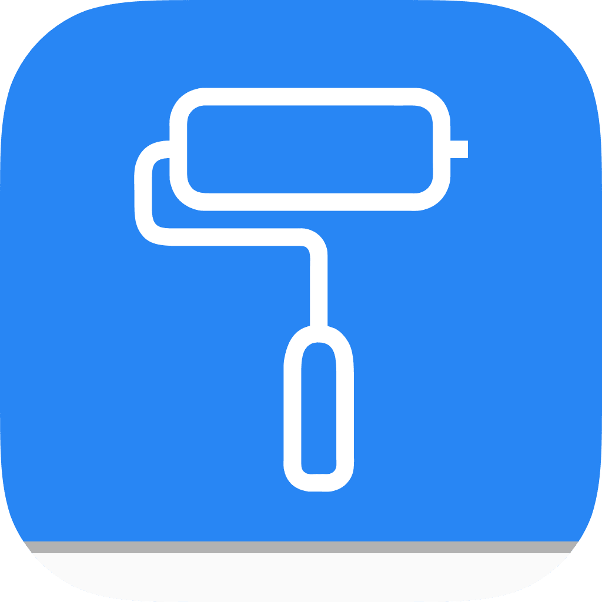
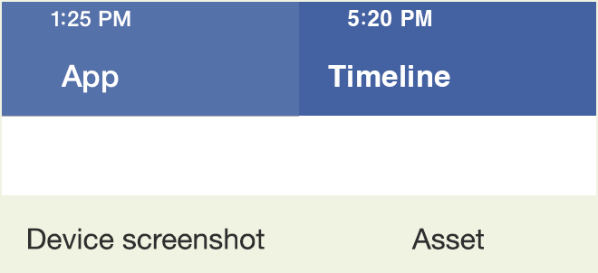

Purpose
-------



The BarTintColorOptimizer app is an iOS developer tool that runs on the device. It helps to find the bar tint color that makes app's translucent bar appearance match the desired color. 

> :warning: Works for bright color schemes only.


Bar tint color and translucency in iOS 7.x and later
----------------------------------------------------

Beginning with iOS 7.x Apple has introduced the translucency of bars. That effect is applied to UINavigationBar, UIToolbar and UITabBar by default. Translucency appears as a mixture of bar tint color with blurred image of the underlying content. Bar looks impressive but the side effect is that the bar's color brightness becomes perceptibly lighter then the brightness of the chosen color. 

For example, make a master-view app and set the navigation bar tint color to sample design asset color `#4462a1`. Running the app on the device you will see the perceptible difference between the app navigation bar's color appeared and the asset's color as shown on the following picture:




How to make bar color match the desired color?
----------------------------------------------
Apple docs contain the [QA1808 Matching a Bar Tint Color To Your Corporate or Brand Color](http://developer.apple.com/library/ios/qa/qa1808/) article. It suggests that you should darken the bar tint color little by little to get the matching color of the bar. 

In practice, it's hard to match the desired color in two or three tries, that's why I made the BarTintColorOptimizer iOS app to search for a matching color automatically. 


Using the app
-------------

You need XCode to compile and run the app on a device. See [details here](http://developer.apple.com/library/mac/documentation/IDEs/Conceptual/AppDistributionGuide/LaunchingYourApponDevices/LaunchingYourApponDevices.html). 

1. Clone this repository via following command
```console
git clone https://github.com/IvanRublev/BarTintColorOptimizer.git
```
2. Open the `BarTintColorOptimizer.xcworkspace` in XCode, connect the device and press <kbd>Cmd+R</kbd> to run the app on the device. It's important to run it on the device because the translucency effect applies differently in the simulator leading to different output color.
3. Set the desired bar color and underlying view color via components or hex input fields.
4. Hit the Optimize button to start the search. Progress view will appear. You can stop the search at any time.
5. When search finishes the initial view will open back and found color will be logged in to the XCode console.

When search is finished you can hit the Log color code button to log the code that uses UIAppearance protocol to colorize all navigation bars and toolbars in the app to the desired color. The code is logged in to the XCode console (press <kbd>Cmd+Shift+C</kbd> to open the Console if it's hidden). The Swift and Objective-C variants of code are available, select the appropriate language via the switch situated to the left of the button.

If you turn the Exact switch off then the reasonable error will be used when comparing bar color with desired color. It can make the search to complete faster. 


How it works
------------

The app examines the color space stochastically choosing the colors for bar tint. It assigns chosen colors to barTintColor property of appropriate number of UINavigationBar views. The color of underlying views are set to previously configured value. Then the app takes the screenshot of navigation bars. For each bar the app calculates the distance between bar's actual color components and desired color components as norm of the vector in three-dimensional space. The calculated distance is shown in bottom right corner of the progress view. Search stops when the distance between the bar color and the desired color becomes equal to zero or if Exact option is switched off when distance is within the margin of error == 1/255. 

The Particle Swarm Optimization algorithm is used to examine the color space. See the [PSOLib](https://github.com/IvanRublev/PSOLib) project for details.


Known limitations
-----------------

* It's impossible to find a match for every desired color. Especially for dark colors. In that case the app finds colors that are far from good match with big distance.
* Translucency effect is different in simulator and on the device. That's why the bar's color matched in the simulator may not match the color shown when app runs on the device.
* Old devices with iOS prior 8.x (for example iPhone 4) has no translucency effect enabled due to performance reasons. Consequentially, the bar color on such devices is shown differently.

Let me know about your findings.


Author
------

Ivan Rublev, ivan@ivanrublev.me


Icon
----

Painting roll image used in app's icon is made by [http://www.webalys.com](http://www.webalys.com).


License
-------

BarTintColorOptimizer is available under the MIT license. See the LICENSE file for more info.

